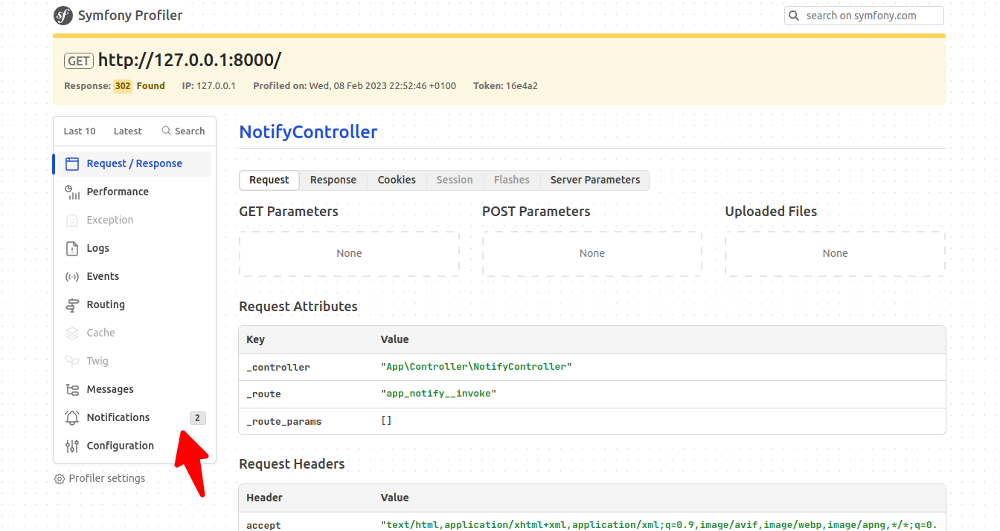
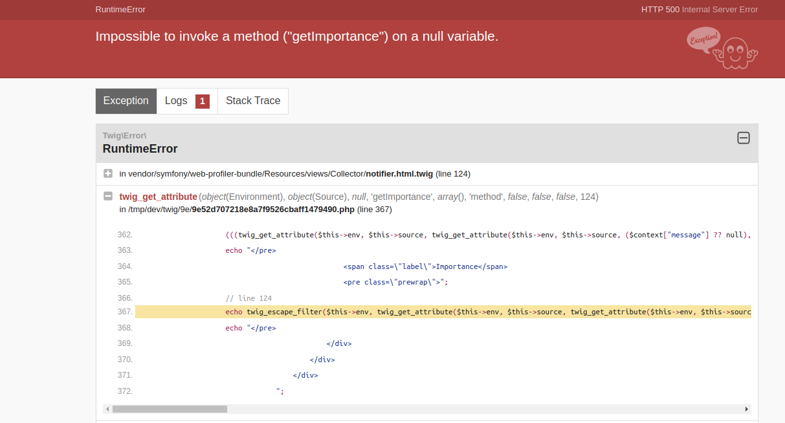
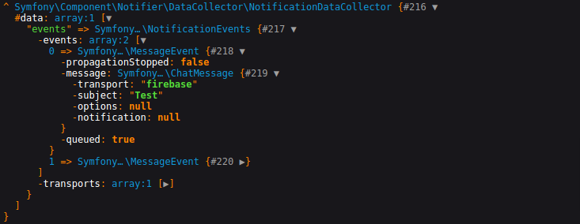

### Description
A null pointer exception thrown on profiler "Notifications" tab when an event message with `null` notification is collected.

## This bug only happen when symfony/notifier and symfony/messenger are installed simultaneous.

### Requirements
composer.json
```json
{
  "require": {
    "php": ">=8.1",
    "ext-ctype": "*",
    "ext-iconv": "*",
    "symfony/console": "6.2.*",
    "symfony/dotenv": "6.2.*",
    "symfony/flex": "^2",
    "symfony/framework-bundle": "6.2.*",
    "symfony/messenger": "6.2.*",
    "symfony/notifier": "6.2.*",
    "symfony/runtime": "6.2.*",
    "symfony/yaml": "6.2.*",
    "twig/twig": "^2.12|^3.0"
  },
  "require-dev": {
    "symfony/web-profiler-bundle": "6.2.*"
  }
}
```

### Run
`symfony serve`

### Process
1. go to `http://127.0.0.1:8000/`
> You are directly redirected to profiler
2. click on last request with status 302
3. Navigate to "Notifications" tab


### Bug
#### Error


#### Collected events

